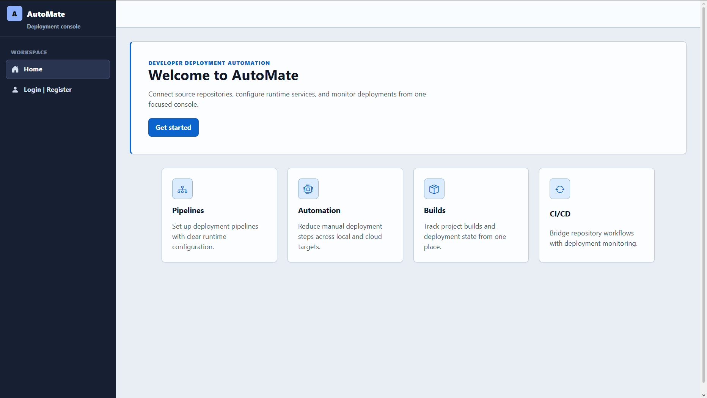
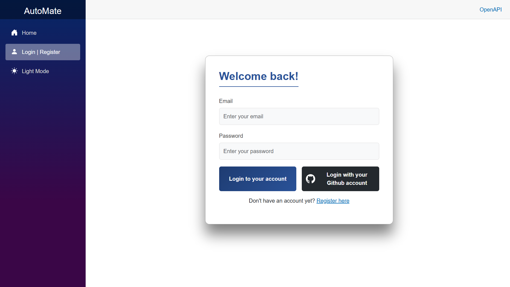
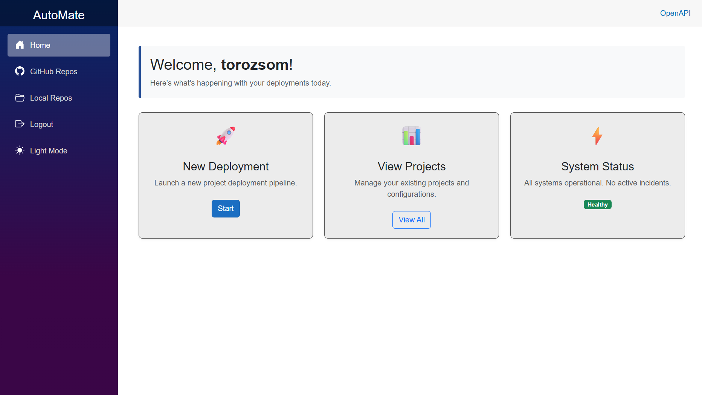
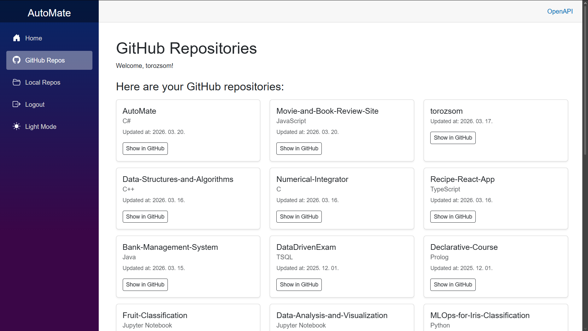
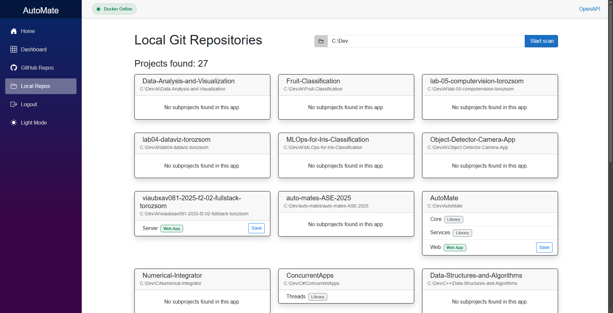

<div align="center">
  <h1>AutoMate</h1>
  
  
  
  
  
</div>


<p align="center"><b>AutoMate</b> is a modern, self-hosted DevOps companion and project management platform built for developers. It bridges the gap between your source code and your hosting environment, allowing you to seamlessly discover, manage, and (soon) deploy your applications whether they are hosted on GitHub or reside locally on your machine.</p>

---

## Screenshots

<div align="center">
  
  
  
  
  
</div>

---

## ✨ Current Features

* **🔐 Hybrid Authentication System**
    * Secure local accounts with hashed passwords and anti-CSRF protection.
    * Seamless OAuth integration with **GitHub** for quick login.
    * Cookie-based session management across all user types.
      
* **📧 Email Verification Pipeline**
    * Built-in confirmation workflow for local registrations.
    * Pluggable email service architecture (Console output for dev, Gmail/SMTP for production).
      
* **🐙 GitHub Integration**
    * Connects to the GitHub API via User Access Tokens.
    * Fetches and beautifully displays all user repositories (public and private).
      
* **📁 Smart Local Scanner**
    * Lightning-fast, cross-platform recursive directory scanner.
    * Automatically detects Git repositories and `.NET` projects (`.sln`, `.csproj`).
    * Enterprise-grade safety: handles symlinks and ignores build artifacts (`bin`, `obj`, `node_modules`).
      
* **🏗️ Clean Architecture**
    * Strict separation of concerns into `Core` (Entities/DTOs), `Services` (Business Logic), and `Web` (Blazor UI & Minimal APIs).

---

## 🗺️ Roadmap (Upcoming Features)

- [ ] **Project Registration:** Save scanned local and GitHub projects into the database.
- [ ] **Docker Engine Integration:** Communicate directly with the local Docker daemon.
- [ ] **Automated Deployments:** Generate `Dockerfile`s on the fly and spin up containers with a single click.
- [ ] **Live Logs & Monitoring:** View real-time container logs directly from the Blazor dashboard.

---

## 🛠️ Tech Stack

* **Frontend:** ASP.NET Core Blazor Server, Bootstrap 5, Bootstrap Icons.
* **Backend:** C#, .NET 10, Minimal APIs.
* **Database:** PostgreSQL, Entity Framework Core (Code-First Migrations).
* **Architecture:** Clean Architecture, Dependency Injection, Repository Pattern logic.

---

## 🚀 Getting Started

### Prerequisites
* [.NET 10.0 SDK](https://dotnet.microsoft.com/download)
* [Docker Desktop](https://www.docker.com/products/docker-desktop) (for running the PostgreSQL database)

### Installation & Setup

1. **Clone the repository:**
   ```bash
   git clone [https://github.com/yourusername/automate.git](https://github.com/yourusername/automate.git)
   cd automate
   cd .docker
   docker-compose up -d
   cd ../Web
   dotnet ef database update --project ../Services
   dotnet run
   ```
   
To enable GitHub OAuth and Real Email sending, configure your .NET User Secrets with your GitHub Client ID/Secret and SMTP credentials.

---

<p align="center">This project is licensed under the MIT License.</p>
