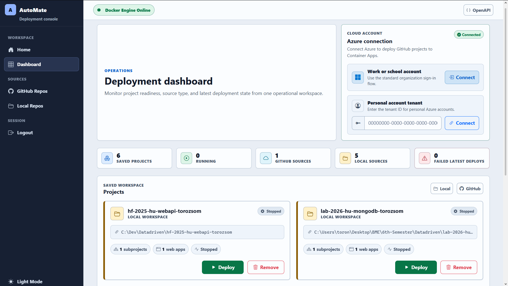
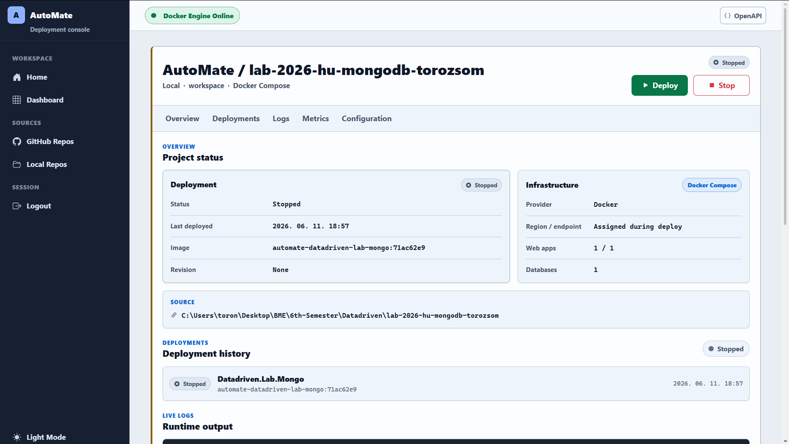
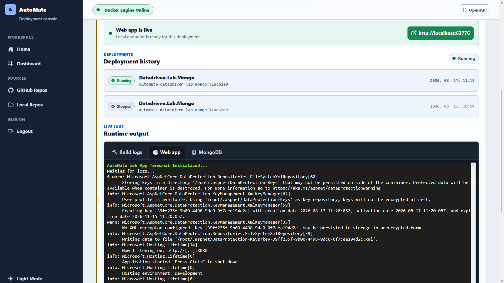
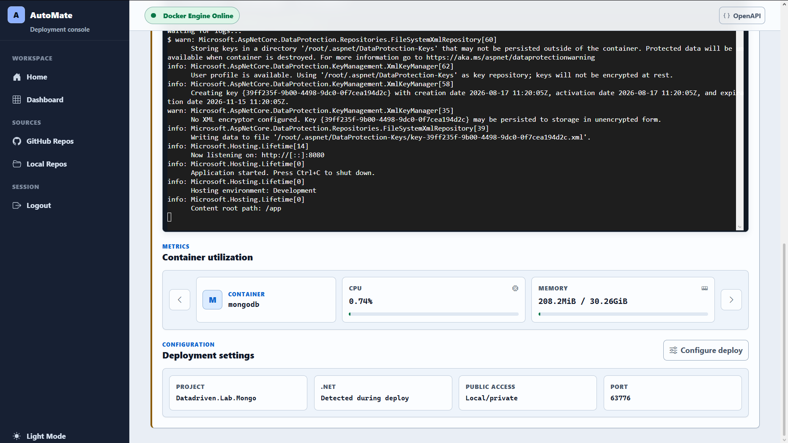

<div align="center">
  <h1>AutoMate</h1>
  <p><b>A self-hosted deployment companion for .NET projects, from source discovery to Docker and Azure Container Apps delivery.</b></p>

  
  
  
  
  
  
</div>

---

## Overview

AutoMate helps developers automate the operational work between "the source code is ready" and "the application is deployed".

It can discover local and GitHub-hosted .NET projects, prepare deployment configuration, generate infrastructure/deployment artifacts from templates, run local Docker Compose deployments, and orchestrate cloud deployments through GitHub Actions and Azure Container Apps.

The application is built with a strict Clean Architecture split:

| Project | Responsibility |
|---|---|
| [`Core`](./Core/README.md) | Framework-neutral entities, DTOs, enums, and shared contracts |
| [`Services`](./Services/README.md) | Business workflows, scanning, templating, Docker, GitHub, Azure, EF Core, orchestration |
| [`Web`](./Web/README.md) | Blazor Server UI, Minimal API endpoints, SignalR hubs, startup and HTTP pipeline |

---

## Screenshots

<div align="center">
  
  <br><br>
  
  <br><br>
  
  <br><br>
  
  <br><br>
  
</div>

---

## Key Features

- Local account registration with email verification
- GitHub OAuth sign-in and repository import
- Azure account connection through Microsoft Entra OAuth
- Local filesystem scanning for Git repositories, `.sln`, `.slnx`, and `.csproj` files
- GitHub repository discovery and C# project registration
- Project dependency analysis for web projects and database providers
- Deployment configuration UI for environments, ports, databases, and environment variables
- Scriban-based artifact generation from a template manifest
- Local Docker Compose deployment for local projects
- GitHub Actions workflow generation for cloud deployments
- GitHub Container Registry image publishing
- Azure OIDC federation setup for GitHub Actions
- Azure Container Apps deployment with managed environment and Log Analytics
- Real-time build logs, container logs, and metrics through SignalR and xterm.js
- Deployment status persistence and live UI status updates
- Startup cleanup hosted service to reconcile persisted deployments with actual runtime state

---

## Deployment Workflows

### Local Docker Workflow

1. The user selects a local project from the dashboard.
2. AutoMate analyzes the `.csproj` graph and inferred dependencies.
3. The user confirms deployment configuration in `ConfigurationForm`.
4. Scriban templates generate Docker artifacts into `.automate/`.
5. AutoMate runs Docker Compose.
6. Build logs, container logs, and metrics stream to the project details page.
7. Deployment state is persisted in PostgreSQL and broadcast to open UI sessions.

Generated local artifacts include:

- `Dockerfile`
- `Dockerfile.dockerignore`
- `docker-compose.yml`

### Azure Container Apps Workflow

1. The user imports a GitHub repository and connects Azure.
2. AutoMate creates or updates a user-assigned managed identity in Azure.
3. AutoMate registers required Azure resource providers:
   - `Microsoft.App`
   - `Microsoft.OperationalInsights`
4. AutoMate configures GitHub Actions OIDC federation on the managed identity.
5. AutoMate upserts GitHub repository secrets:
   - `AZURE_CLIENT_ID`
   - `AZURE_TENANT_ID`
   - `AZURE_SUBSCRIPTION_ID`
   - `GHCR_PAT`
6. AutoMate generates cloud deployment files and commits them to `automate/azure-deployment`.
7. GitHub Actions builds the Docker image and pushes it to GHCR.
8. GitHub Actions authenticates to Azure with OIDC.
9. Bicep deploys:
   - Azure Container App
   - Container Apps managed environment
   - Log Analytics workspace
10. The application becomes available at the generated Azure Container Apps URL.

Generated cloud artifacts include:

- `.automate/Dockerfile`
- `.automate/Dockerfile.dockerignore`
- `infra/main.bicep`
- `.github/workflows/deploy.yml`

---

## Architecture and Design Patterns

AutoMate intentionally keeps infrastructure and UI concerns out of the domain model.

- **Clean Architecture:** `Core` has no dependency on `Services` or `Web`.
- **Dependency Injection:** all orchestration and adapter services are registered behind interfaces.
- **Minimal API endpoint modules:** endpoint classes implement `IEndpoint`; raw route definitions stay out of `Program.cs`.
- **Thin startup:** `Program.cs` delegates service registration and pipeline setup to configuration extensions.
- **Template-driven deployment:** deployment files are rendered from Scriban templates and a manifest.
- **Hosted service lifecycle:** background cleanup uses `IHostedService`, not manual timer threads.
- **SignalR real-time streaming:** logs and metrics are pushed to project-scoped client groups.
- **EF Core TPH inheritance:** local and remote users share the `User` model hierarchy.
- **Data Protection for secrets:** provider access tokens are encrypted before persistence.
- **OAuth and OIDC:** GitHub OAuth for source access, Microsoft OAuth for Azure connection, GitHub Actions OIDC for Azure deployment.
- **Resource ownership boundaries:** generated deployment assets live in target repositories, while AutoMate stores only orchestration metadata.

---

## Tech Stack

| Area | Technology |
|---|---|
| Runtime | .NET 10, ASP.NET Core |
| UI | Blazor Server, Bootstrap 5, Bootstrap Icons |
| Real time | SignalR, xterm.js |
| Persistence | PostgreSQL, Entity Framework Core |
| Cache | Redis distributed cache |
| Local runtime | Docker Engine, Docker Compose |
| Cloud runtime | Azure Container Apps |
| Cloud IaC | Bicep |
| CI/CD | GitHub Actions |
| Registry | GitHub Container Registry |
| Auth | Cookie auth, GitHub OAuth, Microsoft Entra OAuth, GitHub OIDC |
| Templates | Scriban |

---

## Getting Started

### Prerequisites

- [.NET SDK 10.0+](https://dotnet.microsoft.com/download)
- Docker Desktop or Docker Engine with Docker Compose
- PostgreSQL and Redis, or the provided Docker Compose infrastructure
- GitHub OAuth app for GitHub sign-in/repository access
- Microsoft Entra app registration for Azure connection
- Azure subscription for cloud deployments

### 1. Start Local Infrastructure

```bash
cd .docker
docker compose up -d
```

### 2. Configure Secrets

Use user-secrets or environment variables. Do not commit secrets to `appsettings.json`.

Common settings:

```text
ConnectionStrings:DefaultConnection
ConnectionStrings:Redis
Authentication:GitHub:ClientId
Authentication:GitHub:ClientSecret
Authentication:Microsoft:ClientId
Authentication:Microsoft:ClientSecret
Email:SenderEmail
Email:AppPassword
```

For local development from `Web/`:

```bash
dotnet user-secrets set "Authentication:GitHub:ClientId" "<github-client-id>"
dotnet user-secrets set "Authentication:GitHub:ClientSecret" "<github-client-secret>"
dotnet user-secrets set "Authentication:Microsoft:ClientId" "<microsoft-client-id>"
dotnet user-secrets set "Authentication:Microsoft:ClientSecret" "<microsoft-client-secret>"
```

### 3. Apply Database Migrations

Migrations live in `Services`, but the startup project is `Web`.

```bash
cd Web
dotnet ef database update --project ../Services
```

### 4. Run the Application

```bash
cd Web
dotnet run
```

Open the ASP.NET Core URL printed in the terminal.

---

## OAuth and Cloud Setup

### GitHub OAuth

The GitHub OAuth app should allow repository and workflow access. AutoMate requests scopes for:

- user email
- repository access
- workflow access
- package read/write access

### Microsoft Entra OAuth

Use a Web platform app registration with redirect URI:

```text
https://localhost:<port>/signin-microsoft
```

For multi-tenant Azure connection, configure supported account types for organizational accounts and use `organizations` or no explicit tenant setting.

Required delegated permissions include Azure Resource Manager access (`user_impersonation`) plus standard OpenID Connect scopes.

### Azure Permissions

The connected Azure user must be able to:

- create resource groups
- create user-assigned managed identities
- create federated identity credentials
- assign Contributor to the deployment identity
- register required resource providers at subscription scope, or have them pre-registered

In practice, `Owner` on the target subscription/resource group is the simplest development setup.

---

## Developer Workflows

### Add a Migration

```bash
cd Web
dotnet ef migrations add <MigrationName> --project ../Services
dotnet ef database update --project ../Services
```

### Build the Solution

```bash
dotnet build AutoMate.slnx
```

### Run Infrastructure Only

```bash
cd .docker
docker compose up -d
```

### Stop Infrastructure

```bash
cd .docker
docker compose down
```

---

## Repository Notes

- `Program.cs` is intentionally minimal.
- Add Minimal API routes through `Web/Routes/Endpoints/` and register with endpoint discovery.
- Add deployment templates through `Services/Templating/Templates/` and `template-manifest.json`.
- Keep domain contracts in `Core` independent from infrastructure and UI.
- Prefer hosted services for lifecycle/background work.
- Never commit OAuth secrets, app passwords, PATs, or connection-string passwords.

---

## Status

AutoMate currently supports:

- local Docker deployment for local .NET web projects
- GitHub repository import
- Azure connection through Microsoft Entra
- GitHub Actions based Azure Container Apps deployment
- live workflow/build/runtime log streaming

Future improvements may include richer Azure subscription selection, deployment history UX, cost controls, and broader cloud target support.
