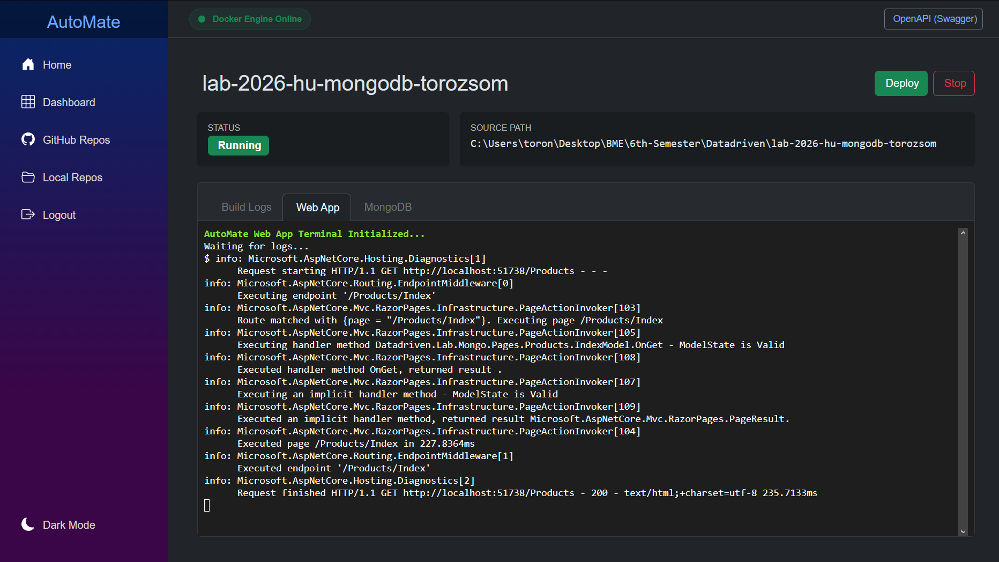

<div align="center">
  <h1>AutoMate</h1>
  <p><b>Self-hosted .NET deployment companion for local and GitHub-based project discovery.</b></p>

  
  
  
  
</div>

---

## What AutoMate does

AutoMate is a modular .NET 10 application that helps you:

- authenticate with **local credentials** or **GitHub OAuth**
- scan your filesystem for **Git repositories** and detect `.NET` projects
- pull your repositories from GitHub and register them in your workspace
- configure and launch **local Docker Compose deployments** for web projects
- stream **live build logs, container logs, and container metrics** into the UI

> Current deployment orchestration is implemented for **local projects**.  
> GitHub repositories can be imported and managed, while cloud deployment is not implemented yet.

---

## Solution structure

| Project | Responsibility |
|---|---|
| `Core` | Domain entities, DTOs, and enums shared by the solution |
| `Services` | Business logic, data access, scanning, templating, Docker orchestration, email, auth |
| `Web` | Blazor Server UI, SignalR hub, Minimal API endpoints, app startup and middleware pipeline |

Each module has its own README:

- [`Core/README.md`](./Core/README.md)
- [`Services/README.md`](./Services/README.md)
- [`Web/README.md`](./Web/README.md)

---

## Runtime architecture (high-level)

1. User signs in (local or GitHub).
2. User discovers projects (local scanner or GitHub API).
3. Selected project is persisted in PostgreSQL.
4. Deployment config is prepared from project metadata and dependency analysis.
5. Docker templates are generated into a `.automate` workspace folder.
6. `docker compose up` is executed.
7. Logs/metrics are streamed via SignalR to terminal components in the dashboard.

---

## Screenshots

<div align="center">
  
  
  
</div>

---

## Tech stack

- **Backend:** .NET 10, ASP.NET Core, Minimal APIs, SignalR
- **Frontend:** Blazor Server, Bootstrap 5, Bootstrap Icons, xterm.js
- **Data:** Entity Framework Core, PostgreSQL, Redis distributed cache
- **Infra:** Docker Engine + Docker Compose
- **Templates:** Scriban-based IaC generation

---

## Getting started

### Prerequisites

- [.NET SDK 10.0.0+](https://dotnet.microsoft.com/download)
- Docker + Docker Compose
- PostgreSQL and Redis (can be started via the provided compose file)

### 1) Start infrastructure

```bash
cd /home/runner/work/AutoMate/AutoMate/.docker
docker compose up -d
```

> The compose file expects `DB_USER` and `DB_PASSWORD` environment variables.

### 2) Configure application settings

Configure connection strings and secret settings (recommended via user secrets / environment variables):

- `ConnectionStrings:DefaultConnection` (PostgreSQL)
- `ConnectionStrings:Redis` (Redis)
- `GitHub:ClientId`, `GitHub:ClientSecret`
- `Email:SenderEmail`, `Email:AppPassword` (for registration verification emails)

### 3) Apply database migrations

```bash
cd /home/runner/work/AutoMate/AutoMate/Web
dotnet ef database update --project ../Services
```

### 4) Run the app

```bash
cd /home/runner/work/AutoMate/AutoMate/Web
dotnet run
```

Then open the local URL printed by ASP.NET Core.
